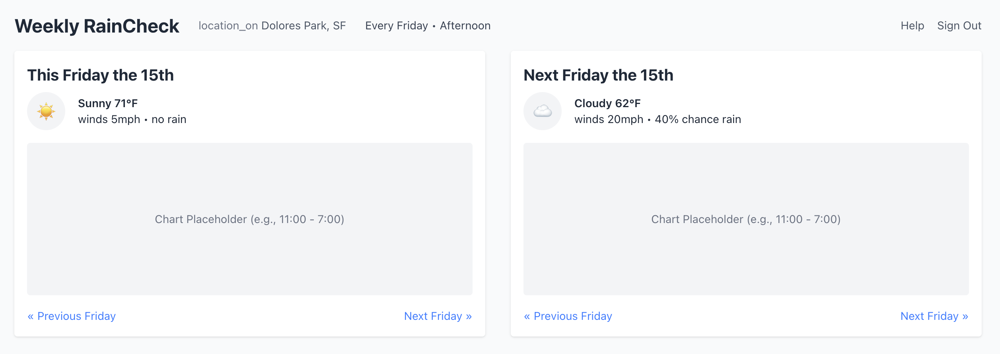
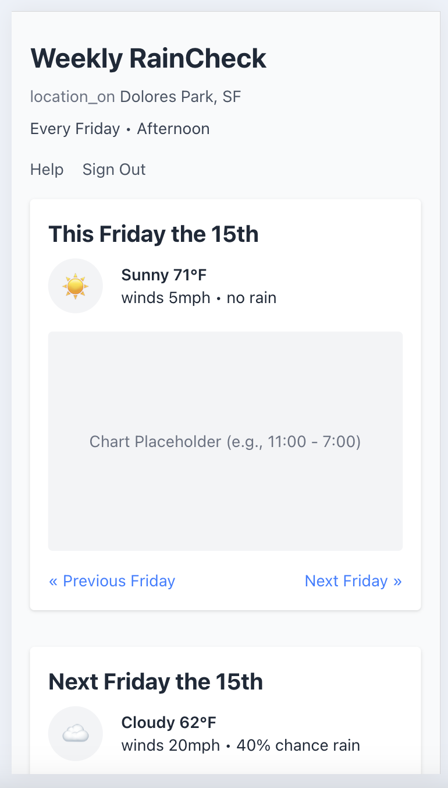

# Weather Helper

## Specific steps

- Process the JSON data into a more usable format
- Stand up a quick front end to render weather data
- Wire up loading a sample set of JSON from public
- Wire up the API calls to Visual Crossing

## Overview

UX table stakes:

- Need the day picker (day of week) -- will require logic to determine closest dates and get weather data
- Need to pick a time of day (morning, afternoon, evening)
- Need to enter location

Capture user preferences:

- Ideal temperature
- Ideal humidity
- Tolerance for rain

Play with various ways of showing user preferences:

- Good/bad for each measure (show a shaded region along with the metric)
- Show shading during the time of interest - likely want to show wider view if doing charts (temp doesn't change quickly)

General UI that needs built:

- Charting interface
- Weather data <> icons

Sample URL: <https://weather.visualcrossing.com/VisualCrossingWebServices/rest/services/timeline/70601?unitGroup=us&key={key}&contentType=json>

Query builder: <https://www.visualcrossing.com/weather-query-builder/#>

## Steps and approach

- Get API access - download test data for diverse set of locations
  - Indy = home
  - Alaska = cold
  - Hawaii = hot
  - Mt Washington = wind
  - Louisiana = humid
- Drop the image into ChatGPT to get starting point for UI

## UI Progression

Initial prototype

## Problems spotted during testing

- Need to get responsive again on the charts (top and bottom)
- Get 1 more hour of data rendered if keeping the whole day plots
- Probably want to interpolate data to 10 minute increments to get a smoother looking chart

## Prototype settings to wire up

- Theme colors - find every color and put it into a color picker
- Which region to shade - good or bad - make this a toggle
- The opacity of the shaded region
- Chart sizes
- Add a small calendar strip that shows the available weather data - allow user to click and get charts for those days - default picks based on the day choice.
- Chart margins and sizes
