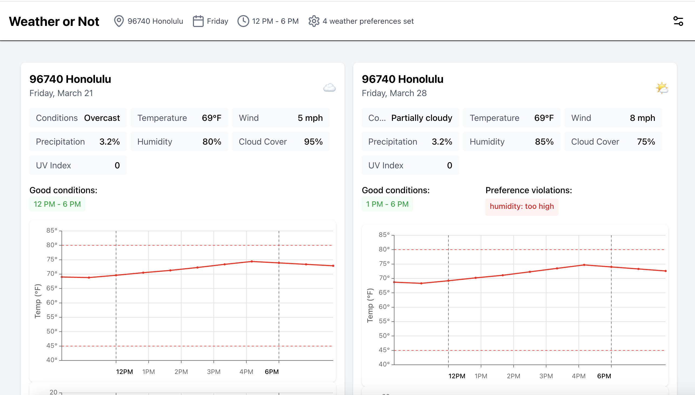
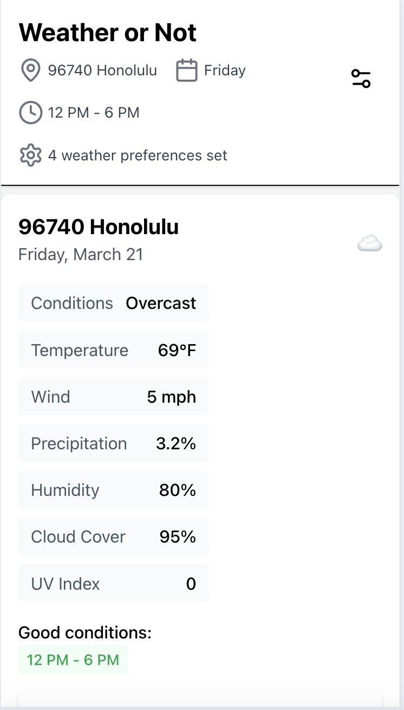
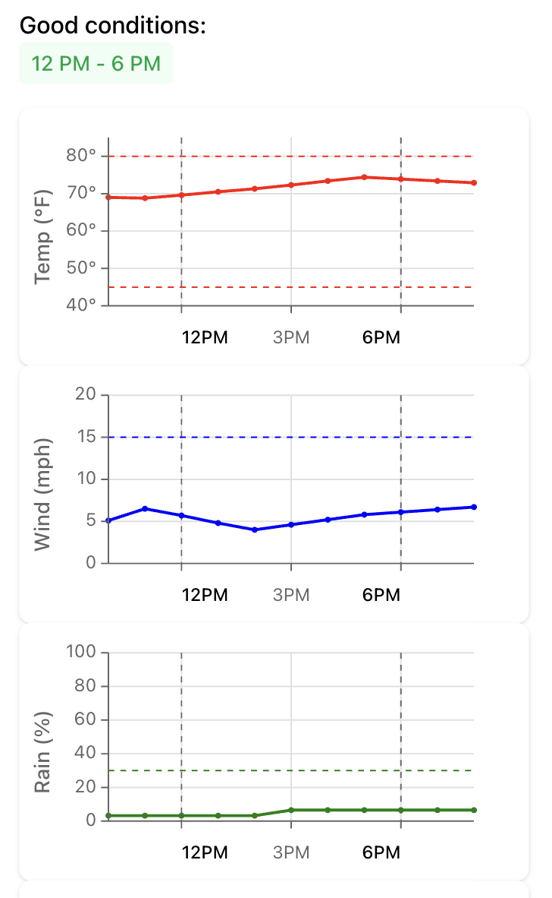
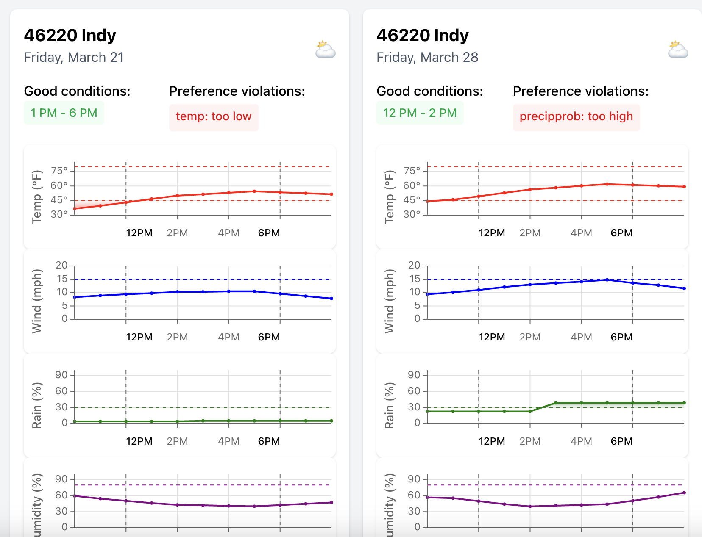
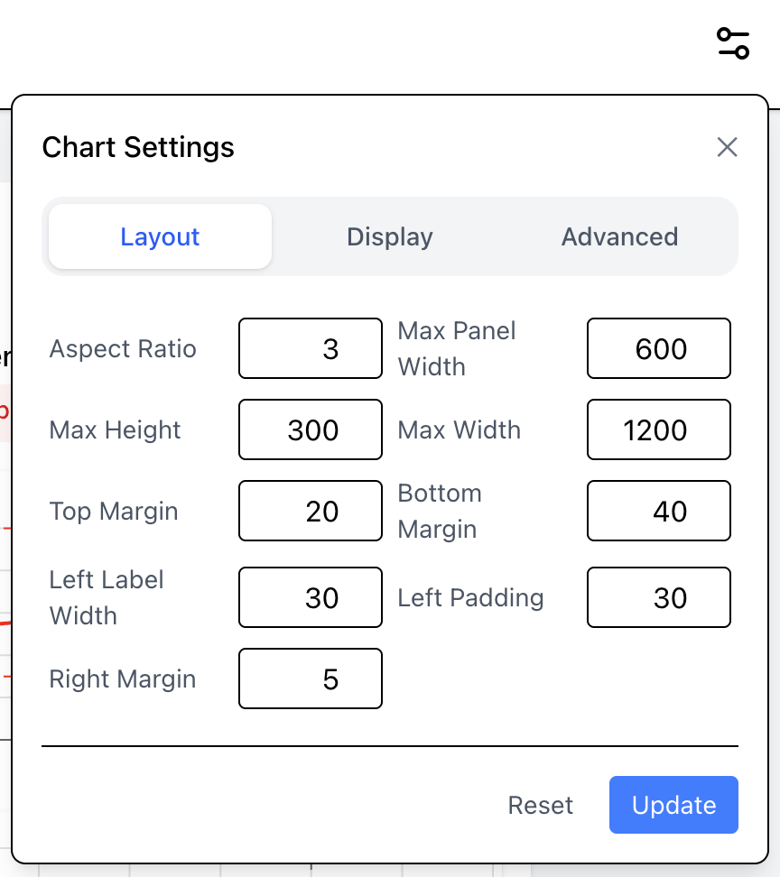

# Weather or Not

A tool to help you decide whether or not to plan an outdoor event. The key feature is that it defaults to displaying a common day (like Friday), showing weather forecasts for consecutive chosen days (like March 21 and March 28).

The site offers a set of charts for the weather conditions.

## Screenshots

### Desktop



### Mobile





## Overview

UX table stakes:

- Need the day picker (day of week) -- will require logic to determine closest dates and get weather data
- Need to pick a time of day (morning, afternoon, evening)
- Need to enter location

Capture user preferences:

- Ideal temperature
- Ideal humidity
- Tolerance for rain

Play with various ways of showing user preferences:

- Good/bad for each measure (show a shaded region along with the metric)
- Show shading during the time of interest - likely want to show wider view if doing charts (temp doesn't change quickly)

General UI that needs built:

- Charting interface
- Weather data <> icons

Sample URL: <https://weather.visualcrossing.com/VisualCrossingWebServices/rest/services/timeline/70601?unitGroup=us&key={key}&contentType=json>

Query builder: <https://www.visualcrossing.com/weather-query-builder/#>

## Steps and approach

- Get API access - download test data for diverse set of locations
  - Indy = home
  - Alaska = cold
  - Hawaii = hot
  - Mt Washington = wind
  - Louisiana = humid
- Drop the image into ChatGPT to get starting point for UI
- Build the core charting functionality - custom SVG
- Build the various popovers and UI to drive the weather preferences and other details
- Identify "prototype-able" parameters and pull them into a settings store
- Refactor and document

## UI Progression

Initial prototype


## UI Options

Playing with the various parameters, you can achieve a number of different looks.

### Tighter look with no metrics

```
Aspect ratio = 3
Max panel width = 400
Show metric values = false
```



## Prototype approach

The main app was built with a number of hard coded magic values and other parameters. Once working, I extracted the parameters into a settings store. The store can be configured with an interface. These settings are persisted to local storage.

Parameters include various chart styles, sizes, and margins. There are also some "should this be visible" flags to guide the overall UI.

The settings also have an export function to quickly apply to the source code as the new "defaults".



## Features

- Synchronized axis limits per metric across all charts
- Preferences and other user specific data stored to local storage

## Comments while building

- Converting the data structure to a flat list of time + metric values was a good move. Made it way easier to filter and process.

## Future work

- Interpolate data to 10 minute increments to get a smoother looking chart
- Drop a vertical cursor on a weather chart to get detailed data for that time - sync across all charts in a panel
- Allow user to show additional weather fields: imagine seeing `snow` along with preferences for snowshoeing.
